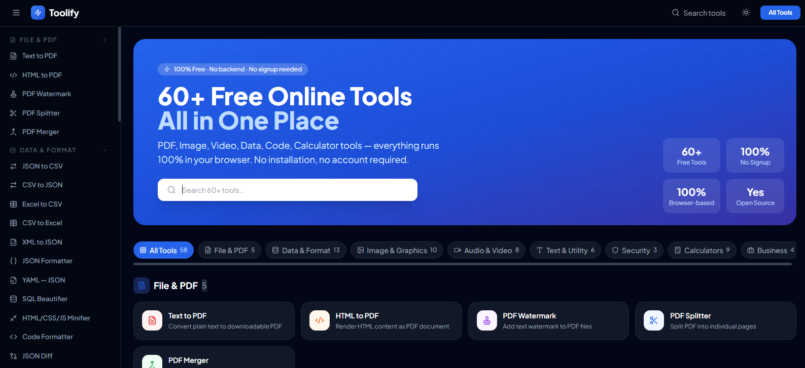

<div align="center">


# ⚡ Toolify

<div align="center">
  
</div>

### 60+ Free Online Tools — All in One Place

**No signup. No account. No backend. No cost. Just tools.**

PDF tools · Image tools · Video tools · Data converters · Calculators · Security tools · Business tools — everything runs 100% in your browser.

[🚀 Live Demo](https://github.com/Kushdeveloper68/toolify) · [📖 Documentation](#getting-started) · [🐛 Report Bug](../../issues) · [✨ Request Feature](../../issues)

---

</div>

## 📸 Preview

> A clean, fast, responsive multi-tool web application built with React + Vite. Search across 60+ tools, filter by category, use dark mode, and download your results — all without leaving your browser.

---

## ✨ Why Toolify?

Most online tool websites are cluttered with ads, paywalls, file size limits, and mandatory signups. **Toolify is different:**

| Feature | Toolify | Other Tools |
|---|---|---|
| 💰 Free | ✅ Always | ⚠️ Freemium |
| 🔐 No Signup | ✅ Never required | ❌ Required |
| 🔒 Privacy | ✅ Files never leave your device | ❌ Uploaded to servers |
| 📶 Works Offline | ✅ After first load | ❌ Server dependent |
| 📦 No File Size Limit | ✅ Limited by your RAM | ❌ Usually 5–25 MB cap |
<!-- | 🚫 No Ads | ✅ Zero ads | ❌ Ad-heavy | -->
| 🌐 No Backend | ✅ Pure client-side | ❌ Server processing |
| 📖 Open Source | ✅ MIT Licensed | ❌ Proprietary |

---

## 🧰 Tools List (60+)

### 📄 File & PDF Tools
| Tool | Description |
|---|---|
| Text to PDF | Convert plain text to a downloadable PDF |
| HTML to PDF | Render HTML/CSS content as a PDF document |
| PDF Watermark | Add custom text watermarks to PDF pages |
| PDF Splitter | Split PDF by page range or extract individual pages |
| PDF Merger | Combine multiple PDF files into a single document |

### 🔄 Data & Format Conversion Tools
| Tool | Description |
|---|---|
| JSON to CSV | Convert JSON arrays to CSV spreadsheet format |
| CSV to JSON | Convert CSV data to structured JSON |
| Excel to CSV | Convert .xlsx / .xls files to CSV (SheetJS) |
| CSV to Excel | Convert CSV data to downloadable Excel file |
| XML to JSON | Parse and convert XML documents to JSON |
| JSON Formatter | Format, validate, and beautify JSON data |
| YAML ↔ JSON | Bidirectional conversion between YAML and JSON |
| SQL Beautifier | Format and prettify SQL queries with dialect support |
| HTML/CSS/JS Minifier | Reduce file size by minifying web code |
| Code Formatter | Auto-format HTML, CSS, and JSON code |
| JSON Diff | Visual side-by-side comparison of two JSON objects |
| Markdown to HTML | Convert Markdown with live preview |
| JWT Decoder | Decode and inspect JWT tokens with expiry info |

### 🖼️ Image & Graphics Tools
| Tool | Description |
|---|---|
| Image Compressor | Compress images without noticeable quality loss |
| Image Resizer | Resize images to exact pixel dimensions |
| Image Converter | Convert between PNG, JPG, and WEBP formats |
| Favicon Generator | Generate favicon files in all standard sizes (16–256px) |
| QR Code Generator | Generate customizable QR codes from any text or URL |
| Barcode Generator | Create barcodes in CODE128, EAN13, UPC, and more |
| Color Picker | Pick colors and get HEX, RGB, HSL, CSS values |
| Gradient Generator | Build beautiful CSS gradients visually |
| Image Cropper | Crop images visually in the browser |
| EXIF Reader | Extract metadata from JPEG/TIFF photo files |

### 🎬 Audio & Video Tools
| Tool | Description |
|---|---|
| Screen Recorder | Record your screen using the MediaRecorder API |
| Voice Recorder | Record audio from microphone, save recordings |
| MP4 to MP3 | Extract audio from video files (FFmpeg.wasm) |
| Video Compressor | Compress video with quality control (FFmpeg.wasm) |
| Audio Compressor | Compress audio with target bitrate (FFmpeg.wasm) |
| Audio Converter | Convert between MP3, WAV, OGG, AAC (FFmpeg.wasm) |
| Video to GIF | Convert video clips to animated GIF (FFmpeg.wasm) |
| Media Metadata Reader | Read duration, resolution, and format info from files |

### 📝 Text & Utility Tools
| Tool | Description |
|---|---|
| Fake Email Generator | Generate realistic fake email addresses in bulk |
| UUID Generator | Generate UUID v4, NanoID, and random hex strings |
| Notes App | Quick notes with local storage + export to PDF/TXT |
| Regex Tester | Live regex testing with match highlighting |
| Lorem Ipsum Generator | Generate placeholder text by words/sentences/paragraphs |
| Text Counter | Count characters, words, sentences, reading time |

### 🔐 Security & Encoding Tools
| Tool | Description |
|---|---|
| Password Strength Checker | Score your password with detailed security tips |
| Hash Generator | Generate MD5, SHA-1, SHA-256, SHA-512, SHA-3 hashes |
| Base64 Encode/Decode | Encode or decode text and files to/from Base64 |

### 🧮 Calculators & Student Tools
| Tool | Description |
|---|---|
| Scientific Calculator | Full scientific calculator with sin, cos, log, factorial |
| Matrix Calculator | Add, multiply, transpose matrices, compute determinant |
| Unit Converter | Convert Length, Weight, Temperature, Speed, Area, Volume |
| EMI Calculator | Calculate loan EMI with full amortization schedule |
| GST Calculator | Calculate GST inclusive/exclusive with CGST/SGST split |
| Percentage Calculator | 4 percentage formulas in one tool |
| GPA / CGPA Calculator | Calculate GPA with grade-to-credit weighting |
| Age Calculator | Exact age with days, weeks, hours, and birthday countdown |
| Random Number Generator | Generate unique or non-unique numbers in any range |

### 💼 Business & Document Automation
| Tool | Description |
|---|---|
| Invoice Generator | Create professional invoices and download as PDF |
| Signature Generator | Draw digital signature, export as PNG or SVG |
| Business Card Generator | Design and download business cards as PNG |
| Time Tracker | Track time across tasks with CSV export |

---

## 🚀 Getting Started

### Prerequisites

- **Node.js** v18 or later
- **npm** v8+ or **yarn**

### Installation

```bash
# 1. Clone the repository
git clone https://github.com/YOUR_USERNAME/toolify.git

# 2. Navigate to the project
cd toolify

# 3. Install dependencies
pnpm install

# 4. Start the development server
pnpm run dev
```

Open [http://localhost:5173](http://localhost:5173) in your browser.

### Build for Production

```bash
# Build optimized static files
pnpm run build

# Preview the production build locally
pnpm run preview
```

The `dist/` folder contains your fully static website — deploy anywhere (Vercel, Netlify, GitHub Pages, Cloudflare Pages, etc.)

---

## 🏗️ Tech Stack

### Core Framework
| Technology | Version | Purpose |
|---|---|---|
| [React](https://react.dev/) | 18 | UI library |
| [Vite](https://vitejs.dev/) | 5 | Build tool and dev server |
| [React Router](https://reactrouter.com/) | 6 | Client-side routing |
| [TailwindCSS](https://tailwindcss.com/) | 3 | Utility-first styling |

### Libraries by Category

#### PDF & Documents
| Library | Purpose |
|---|---|
| [pdf-lib](https://pdf-lib.js.org/) | PDF creation, watermark, splitting, merging |
| [jsPDF](https://github.com/parallax/jsPDF) | HTML to PDF conversion |
| [html2canvas](https://html2canvas.hertzen.com/) | DOM screenshot for PDF/image export |

#### Data & Conversion
| Library | Purpose |
|---|---|
| [SheetJS (xlsx)](https://sheetjs.com/) | Excel/CSV read and write |
| [js-yaml](https://github.com/nodeca/js-yaml) | YAML parsing and serialization |
| [sql-formatter](https://github.com/sql-formatter-org/sql-formatter) | SQL query beautification |
| [marked](https://marked.js.org/) | Markdown to HTML parsing |

#### Image & Graphics
| Library | Purpose |
|---|---|
| [browser-image-compression](https://github.com/Donaldcwl/browser-image-compression) | Client-side image compression |
| [QRCode.js](https://github.com/soldair/node-qrcode) | QR code generation |
| [JsBarcode](https://github.com/lindell/JsBarcode) | Barcode generation |
| [react-colorful](https://omgovich.github.io/react-colorful/) | Color picker component |
| [exifr](https://github.com/MikeKovarik/exifr) | EXIF metadata extraction |

#### Audio & Video
| Library | Purpose |
|---|---|
| [@ffmpeg/ffmpeg](https://ffmpegwasm.netlify.app/) | WebAssembly FFmpeg — video/audio processing |
| MediaRecorder API | Native browser screen + voice recording |

#### Security & Utilities
| Library | Purpose |
|---|---|
| [CryptoJS](https://github.com/brix/crypto-js) | MD5, SHA-256, SHA-512, RIPEMD160 hashing |
| [react-signature-canvas](https://github.com/agilgur5/react-signature-canvas) | Signature drawing pad |

#### UI & Icons
| Library | Purpose |
|---|---|
| [Lucide React](https://lucide.dev/) | Icon library |
| [react-dropzone](https://react-dropzone.js.org/) | Drag-and-drop file uploads |

---

## 📁 Project Structure

```
toolify/
├── public/
│   └── favicon.svg
├── src/
│   ├── App.jsx                    # Root app with all 60+ routes
│   ├── main.jsx                   # React entry point
│   ├── index.css                  # Global styles + Tailwind
│   │
│   ├── components/
│   │   ├── layout/
│   │   │   ├── Navbar.jsx         # Top navigation bar
│   │   │   ├── Sidebar.jsx        # Collapsible sidebar with all tools
│   │   │   └── Footer.jsx         # Site footer
│   │   └── shared/
│   │       ├── ToolLayout.jsx     # Wrapper for all tool pages
│   │       ├── FileDropzone.jsx   # Reusable drag-and-drop file upload
│   │       └── CopyButton.jsx     # One-click copy to clipboard
│   │
│   ├── data/
│   │   └── tools.js               # Tool metadata, categories, routes
│   │
│   ├── hooks/
│   │   ├── useLocalStorage.js     # Persistent state with localStorage
│   │   └── useDarkMode.js         # Dark mode toggle and persistence
│   │
│   ├── pages/
│   │   ├── Home.jsx               # Landing page with search + categories
│   │   └── tools/                 # 58 individual tool pages
│   │       ├── JsonToCsv.jsx
│   │       ├── PdfMerger.jsx
│   │       ├── ImageCompressor.jsx
│   │       ├── ScientificCalculator.jsx
│   │       ├── InvoiceGenerator.jsx
│   │       └── ... (58 total)
│   │
│   └── utils/
│       └── fileUtils.js           # File download, read, format helpers
│
├── index.html
├── vite.config.js
├── tailwind.config.js
├── postcss.config.js
└── package.json
```

---

## 🌟 Features

### UX & Interface
- 🔍 **Global search** — search across all 60+ tools instantly
- 🗂️ **Category filters** — filter by PDF, Image, Data, Video, Calculator, etc.
- 🌙 **Dark mode** — toggle with persistence via localStorage
- 📱 **Fully responsive** — works on mobile, tablet, and desktop
- ⚡ **Fast navigation** — React Router SPA with no page reloads
- 🧭 **Collapsible sidebar** — categorized tool navigation

### Privacy & Performance
- 🔒 **Zero data transmission** — all files stay on your device
- 🚫 **No tracking** — no analytics, no cookies, no fingerprinting
- 💾 **Local persistence** — Notes App and Time Tracker save to localStorage
- ⚡ **Lazy-loaded FFmpeg** — heavy WASM only loads when you actually use video tools
- 📦 **Downloadable outputs** — every tool lets you download the result

### Developer-Friendly
- 🧩 **Modular architecture** — each tool is a self-contained React component
- 🎨 **Consistent design system** — shared components, Tailwind classes
- 📐 **Easy to extend** — add a new tool in 3 steps (create page, add to data/tools.js, add route)

---

## ⚙️ Configuration

### Vite Config
```js
// vite.config.js
export default defineConfig({
  plugins: [react()],
  server: {
    headers: {
      // Required for FFmpeg.wasm SharedArrayBuffer support
      'Cross-Origin-Opener-Policy': 'same-origin',
      'Cross-Origin-Embedder-Policy': 'require-corp',
    }
  }
})
```

> ⚠️ **Note:** The COOP/COEP headers are required for FFmpeg.wasm to function. When deploying, make sure your hosting provider supports setting these headers (Vercel and Netlify both support this).

### Deployment (Netlify)
Create `netlify.toml`:
```toml
[[headers]]
  for = "/*"
  [headers.values]
    Cross-Origin-Opener-Policy = "same-origin"
    Cross-Origin-Embedder-Policy = "require-corp"
```

### Deployment (Vercel)
Create `vercel.json`:
```json
{
  "headers": [
    {
      "source": "/(.*)",
      "headers": [
        { "key": "Cross-Origin-Opener-Policy", "value": "same-origin" },
        { "key": "Cross-Origin-Embedder-Policy", "value": "require-corp" }
      ]
    }
  ]
}
```

---

## 🤝 Contributing

Contributions are what make open source amazing. **All contributions are welcome and appreciated!**

### Ways to Contribute

- 🐛 **Report bugs** — open an issue with steps to reproduce
- 💡 **Suggest new tools** — open an issue with `[Feature Request]` in the title
- 🔧 **Fix bugs** — check open issues and submit a PR
- 🛠️ **Add new tools** — follow the guide below
- 📝 **Improve docs** — fix typos, add examples, improve clarity
- 🎨 **Improve UI/UX** — better layouts, animations, accessibility
- 🌍 **Translate** — help add i18n support

### Adding a New Tool

**Step 1:** Create your tool page in `src/pages/tools/`
```jsx
// src/pages/tools/MyNewTool.jsx
import ToolLayout from '../../components/shared/ToolLayout';
import { Wrench } from 'lucide-react';

export default function MyNewTool() {
  return (
    <ToolLayout
      title="My New Tool"
      description="What this tool does"
      icon={Wrench}
    >
      {/* Your tool UI here */}
    </ToolLayout>
  );
}
```

**Step 2:** Register it in `src/data/tools.js`
```js
{
  id: 'my-new-tool',
  name: 'My New Tool',
  desc: 'Short description of what it does',
  path: '/tools/my-new-tool',
  category: 'text',          // file | data | image | audio-video | text | security | calculator | business
  icon: 'Wrench',            // any lucide-react icon name
  color: 'blue',             // red | orange | yellow | green | teal | cyan | blue | indigo | purple | pink
}
```

**Step 3:** Add the route in `src/App.jsx`
```jsx
import MyNewTool from './pages/tools/MyNewTool';
// ...
<Route path="/tools/my-new-tool" element={<MyNewTool />} />
```

That's it! Your tool is now searchable, categorized, and accessible from the sidebar.

### Pull Request Guidelines

1. Fork the repository and create your branch from `main`
   ```bash
   git checkout -b feature/tool-name
   ```
2. Make your changes and test locally
3. Ensure code is clean and consistent with existing patterns
4. Commit with a descriptive message
   ```bash
   git commit -m "feat: add Word Count Estimator tool"
   ```
5. Push to your fork and open a Pull Request
6. Fill in the PR template — describe what you built and why

### Commit Convention

| Prefix | Use for |
|---|---|
| `feat:` | New tool or feature |
| `fix:` | Bug fix |
| `ui:` | UI/styling changes |
| `docs:` | Documentation only |
| `refactor:` | Code restructure, no behavior change |
| `chore:` | Build, deps, config changes |

---

## 🗺️ Roadmap

- [ ] Add more tools (Word to PDF, CSV Merger, JSON Schema Validator...)
- [ ] PWA support — install as an app, full offline mode
- [ ] Drag-and-drop tool reordering on homepage
- [ ] Favorites / bookmarked tools
- [ ] Recent tools history
- [ ] i18n — Hindi, Spanish, French, and more
- [ ] Keyboard shortcuts
- [ ] Batch processing — run one tool on multiple files
- [ ] Shareable tool URLs with pre-filled inputs
- [ ] More calculator tools (Tip, Currency, Discount...)

Have an idea? [Open a feature request →](../../issues/new)

---

## 📊 Tool Count by Category

| Category | Count |
|---|---|
| Data & Format | 13 |
| Image & Graphics | 10 |
| Audio & Video | 8 |
| Calculators | 9 |
| File & PDF | 5 |
| Text & Utility | 6 |
| Security | 3 |
| Business | 4 |
| **Total** | **58+** |

---

## 🔒 Privacy Policy (Simple Version)

- **Your files never leave your device.** All processing happens in your browser using JavaScript and WebAssembly.
- **No data is sent to any server** (except loading FFmpeg.wasm from a CDN on first use of video tools).
- **No cookies**, no tracking scripts, no analytics.
- **Notes and preferences** are saved only in your browser's localStorage — never transmitted.

---

## 📄 License

This project is licensed under the **MIT License** — free to use, modify, and distribute, even for commercial projects.

```
MIT License

Copyright (c) 2025 Toolify Contributors

Permission is hereby granted, free of charge, to any person obtaining a copy
of this software and associated documentation files (the "Software"), to deal
in the Software without restriction, including without limitation the rights
to use, copy, modify, merge, publish, distribute, sublicense, and/or sell
copies of the Software, and to permit persons to whom the Software is
furnished to do so, subject to the following conditions:

The above copyright notice and this permission notice shall be included in
all copies or substantial portions of the Software.
```

---

## 🙏 Acknowledgements

- [FFmpeg.wasm](https://ffmpegwasm.netlify.app/) — for making browser-side video processing possible
- [pdf-lib](https://pdf-lib.js.org/) — excellent in-browser PDF manipulation
- [Lucide](https://lucide.dev/) — beautiful, consistent icon set
- [SheetJS](https://sheetjs.com/) — the gold standard for spreadsheet parsing in JS
- All open source contributors who made these amazing libraries free to use

---

## 📬 Contact & Support

- 🐛 **Found a bug?** → [Open an issue](../../issues)
- 💡 **Have an idea?** → [Request a feature](../../issues/new)
- 💬 **Questions?** → [Start a discussion](../../discussions)

---

<div align="center">

**Built with ❤️ for the open source community**

If Toolify saved you time, consider giving it a ⭐ — it helps more people discover the project!

[](../../stargazers)
[](../../forks)

</div>